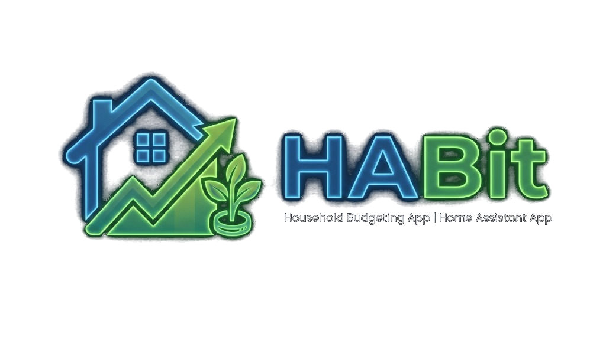

<div align="center">



# HABit — Household Budget Planner

### *A private, payday-anchored household cashflow and budget manager for Home Assistant*

[](https://my.home-assistant.io/redirect/supervisor_add_addon_repository/?repository_url=https%3A%2F%2Fgithub.com%2Fbb12ett%2FHABit)

</div>

---

## 🌟 Why HABit?

Most traditional budgeting apps force you into rigid 1st-to-31st calendar months. But real life doesn't work that way — **most households budget from payday to payday**.

**HABit** is designed from the ground up to reflect how you actually manage your money:
- **Anchored to your Payday**: Every budget cycle aligns with your real payday rather than artificial calendar months.
- **Flexible Pay Frequencies**: Full native support for **Monthly**, **Semi-Monthly** (twice a month), **Bi-Weekly** (every 2 weeks / 26 paychecks), **4-Weekly** (NHS / 28-day cycle / 13 paychecks), and **Weekly** (52 paychecks) schedules.
- **Household & Multi-User Privacy**: Switch between individual user profiles and joint household views. Protect personal checking accounts and salary figures with a secure 4-digit PIN.
- **Multi-Account Projections**: Live balance tracking for Current Accounts, Credit Cards, and Savings Pots / ISAs.
- **Credit Card Auto-Pay Intelligence**: Automatically schedules credit card statement payoffs (full balance or fixed monthly amounts) from your chosen current account in the right week.
- **Bank Holiday Smart Shifts**: Direct debits and scheduled bills automatically shift forward or backward when falling on weekends or public holidays (UK England & Wales, UK Scotland, US Federal).
- **Interactive Financial Calculator**: Press `Alt+C` anytime for a floating calculator with an interactive **Value Picker** that lets you click any number on your budget to calculate with it!
- **100% Local & Private**: No cloud accounts, no subscriptions, no bank connections, and zero tracking. All your financial data stays securely on your Home Assistant system.

---

## ✨ Key Features

| Feature | Description |
| :--- | :--- |
| 📅 **Payday Schedules** | Automatically builds cashflow cycles anchored to your payday frequency (Monthly, Semi-Monthly, Bi-Weekly, 4-Weekly, or Weekly) with dynamic 4/5-week breakdowns. |
| 👥 **Multi-User & Privacy PINs** | Manage joint household finances and individual personal accounts. Set security PINs to keep personal accounts and salary details private. |
| 💳 **Multi-Account Tracking** | Real-time tracking of Current Accounts, Credit Cards (with credit limits and autopay rules), and Savings / Investment accounts. |
| 🧾 **Scheduled Bills & Inflows** | Manage recurring monthly, yearly, and periodic bills with bank holiday shift rules and automatic savings transfers. |
| 🛒 **Weekly Living Envelopes** | Plan weekly allowances (Groceries, Fuel, Misc, Cash), log actual spends, and move items across weeks with ease. |
| 🎂 **Birthdays & Occasions** | Dedicated gift planner with per-person budgets, gift notes, and purchase status tracking. |
| 📊 **Year Overview & Trends** | Visual charts and summary tables comparing annual income, fixed commitments, weekly spend, and savings growth. |
| 🧮 **Built-in Calculator (`Alt+C`)** | Draggable, minimizable on-screen calculator featuring calculation history and a click-to-pick **Value Picker**. |
| ⚡ **Speed-Dial Action Button** | Bottom-corner quick action button for instant balance check-ins, quick expense logging, and birthday purchases. |
| 🧭 **Material Design 3 Navigation** | Collapsible desktop navigation rail (full-drawer $\rightleftharpoons$ icons-only) and streamlined mobile bottom navigation bar with full-bleed Home Assistant kiosk integration. |
| 🎨 **4 Visual Themes** | Choose between Dark Charcoal, Navy Dark, Clean Light, and High Contrast modes. |

---

## 🚀 Installation

### Option 1: 1-Click Install via "My Home Assistant" (Recommended)
Click the button below to add this repository directly to your Home Assistant instance:

[](https://my.home-assistant.io/redirect/supervisor_add_addon_repository/?repository_url=https%3A%2F%2Fgithub.com%2Fbb12ett%2FHABit)

### Option 2: Manual Installation via Add-on Store
1. Open your **Home Assistant** dashboard.
2. Go to **Settings** > **Add-ons** > **Add-on Store**.
3. Click the three vertical dots (**⋮**) in the top-right corner and select **Repositories**.
4. Paste the repository URL into the field:
   ```text
   https://github.com/bb12ett/HABit
   ```
5. Click **Add**, then close the dialog.
6. Refresh the store page, locate **HABit - Household Budget Planner**, and click **Install**.
7. Enable **Show in sidebar**, then click **Start**.
8. Open the **Budget** item in your sidebar or click **Open Web UI**.

---

## 🧙 First-Time Setup Wizard

When you open HABit for the first time, a guided setup wizard will walk you through your budget in 5 simple steps:
1. **Appearance & Regional Settings**: Choose your visual theme, currency symbol (`£`, `$`, `€`, etc.), payday frequency, and bank holiday calendar.
2. **Household & Accounts**: Add household members, checking accounts, credit cards, and savings pots.
3. **Monthly Direct Debits**: Add regular monthly commitments (Mortgage/Rent, Utilities, Council Tax, Subscriptions).
4. **Annual & Periodic Bills**: Add bills that occur once or twice a year (Car Insurance, TV Licence, Subscriptions) and assign them to specific months.
5. **Weekly Living Allowances**: Set baseline living budgets for groceries, transport, fuel, and discretionary spending.

You can relaunch the setup wizard at any time or adjust settings directly from **Settings (☰)**.

---

## 🧮 Interactive Calculator & Value Picker

HABit includes an integrated financial calculator designed for budgeting workflows:
- **Shortcut**: Press **`Alt + C`** anywhere to open the calculator.
- **Value Picker Mode**: Click **"Pick Value"** in the calculator header, then click any budget figure on your screen to instantly input that number into your calculation!
- **Calculation History**: Review past calculations and re-use results with a single click.
- **Minimize to Badge**: Minimize the calculator to a discreet floating badge while you scroll and navigate through weeks.

---

## 🔒 Privacy & Data Backups

- **100% Local**: All budget information, accounts, and history stay strictly on your local Home Assistant system.
- **Persistent Storage**: All data persists automatically across add-on updates and system reboots.
- **Manual Backups**: Export a standalone `.json` backup file anytime via **Settings (☰) > Export Data**, or restore an existing backup with **Import Data**.
- **Home Assistant Backups**: Standard Home Assistant backups (full or partial) automatically protect and backup all your HABit data.

---

## 🤝 Feedback & Support

Questions, feature suggestions, or bug reports?
- Open an issue on our [GitHub Issues](https://github.com/bb12ett/HABit/issues) page.

---

<div align="center">
  <sub>Built with ❤️ for the Home Assistant Community by bb12ett</sub>
</div>
