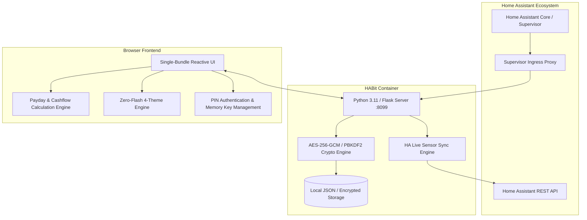

# Welcome to HABit (Household Budget Planner)

**HABit** is a privacy-first, payday-anchored household budget and cashflow manager designed specifically for **Home Assistant** and self-hosted smart homes.

Unlike conventional budgeting apps that force your finances into calendar months (1st to 31st) and store your sensitive financial data on third-party cloud servers, HABit operates **100% locally**, aligns with your actual **payday-to-payday cycles**, and deeply integrates with Home Assistant for live dashboards and smart automations.

---

## 🌟 Why HABit? (The Core Philosophy)

### 1. Payday-to-Payday vs. Calendar Budgeting
Most financial stress occurs because bills, allowances, and daily spending are budgeted for calendar months, but income arrives on specific paydays (e.g., 25th of the month, 4th Friday, last working day, or bi-weekly).
- When a month has 5 weeks instead of 4, traditional apps fail to account for the extra week of spending.
- When payday falls on a weekend or bank holiday, your bank balance shifts earlier or later.
- HABit solves this by calculating exact **payday-anchored periods**, splitting them into real 4 or 5-week cycles, and adjusting automatically for bank holidays.

### 2. 100% Local-First & Zero Cloud Subscriptions
- **Zero Third-Party APIs**: No Plaid, no open-banking subscriptions, no data harvesting.
- **Zero Telemetry**: Your income, accounts, debts, and transaction records stay entirely on your Home Assistant server.
- **AES-256-GCM Encryption**: Optional database encryption with PBKDF2 key derivation protects your financial data at rest.

### 3. Native Home Assistant Integration
- Runs seamlessly inside Home Assistant via **Ingress**.
- Automatically publishes live sensors (`sensor.habit_net_position`, `sensor.habit_days_until_payday`, `sensor.habit_weekly_allowance_remaining`, etc.) to Home Assistant.
- Power custom Lovelace dashboards, wall tablet screens, and proactive automations (e.g. alerts when safe-to-spend allowance is running low).

### 4. Single-PIN Multi-User Household Privacy
- Seamlessly manages individual personal accounts and shared household joint finances.
- **Single-PIN Envelope Security**: Enter **1 PIN** to unlock both your personal profile and the shared joint view simultaneously—without ever exposing your partner's private data or typing multiple PINs.

---

## 📚 Wiki Navigation & Documentation Map

Explore the deep-dive documentation pages below:

| Documentation Section | What's Covered |
| :--- | :--- |
| 🚀 **[Installation & Getting Started](Installation-and-Getting-Started)** | Add-on repository installation, Ingress setup, and Onboarding Wizard walkthrough. |
| 📅 **[Payday Cycles & Calendar Engine](Payday-Cycles-and-Calendar-Engine)** | Pay frequency mathematics, 4/5-week splits, bank holiday engine, and rollover equations. |
| 💳 **[Accounts & Credit Cards](Accounts-and-Credit-Cards)** | Checking, Savings, Credit Cards, autopay/statement calculation engine, and limits. |
| ⚡ **[Open Banking & Bank Sync](Open-Banking-and-Bank-Sync)** | TrueLayer, Enable Banking, GoCardless, SimpleFIN, offline statements, and automated bill matching. |
| 📋 **[Scheduled Bills & Direct Debits](Scheduled-Bills-and-Direct-Debits)** | Direct Debits, standing orders, working-day shifts, and payment status lifecycle. |
| 🔒 **[Multi-User Mode & Security](Multi-User-Mode-and-Security)** | Single-PIN envelope encryption, AES-256-GCM crypto, salary masking, and session lock. |
| 🎯 **[Budgets & Occasions](Budgets-and-Occasions)** | Category envelopes, Live Daily Pacing (`calculateLiveDailyPacing`), and gift/occasion tracking. |
| 📈 **[Annual Trajectory & Spend Analytics](Annual-Trajectory-and-Analytics)** | 12-month projections, Live Spend donut charts, Top Merchants, and custom merchant rules. |
| 🏠 **[Home Assistant Sensors & Automations](Home-Assistant-Sensors-and-Automations)** | Entity reference, Lovelace dashboard YAML cards, and notification automations. |
| 🛠️ **[Interface, Navigation & Tools](Interface-Navigation-and-Tools)** | Material Design 3 navigation rail, mobile bottom bar, Financial Calculator (`Alt+C`), Value Picker, and Themes. |
| ⚖️ **[Financial Disclaimer & Terms](Financial-Disclaimer)** | Legal disclaimers, mathematical estimation notices, bank verification, and liability limitations. |

---

## 🏗️ Technical Architecture Overview

---

## 📄 License & Open Source Commitment

HABit is licensed under the **[GNU Affero General Public License v3.0 (AGPLv3)](https://www.gnu.org/licenses/agpl-3.0.html)**. 
- **100% Free**: Free to use, modify, and distribute for the Home Assistant and self-hosting community.
- **Copyleft Protection**: Ensures that no commercial entity or cloud vendor can take HABit, close the source code, and sell it as a paid product. All derivative works must remain free and open source under AGPLv3.

---

## ⚖️ Financial Disclaimer & Limitation of Liability

**HABit is an informational personal cashflow estimation tool, not a certified financial planner, accountant, or banking service.**

- All calculations, projections, safe-to-spend allowances, and holiday bill schedules are mathematical approximations.
- Users are solely responsible for independently verifying all account balances, credit limits, and scheduled bill dates directly with their official financial institutions.
- To the fullest extent permitted by law, the authors and contributors disclaim all liability for any financial losses, overdraft charges, bank fees, or penalties arising from the use of this software.
- Read the full [Financial Disclaimer & Terms](Financial-Disclaimer).
