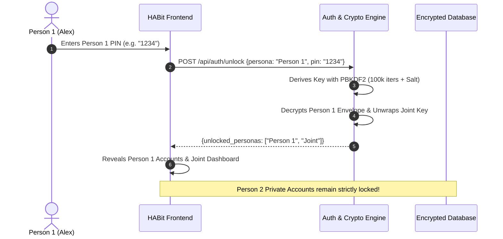

# Multi-User Mode & Security Architecture

HABit includes a state-of-the-art **Multi-User Envelope Encryption & Privacy Engine**, engineered to provide complete financial privacy for individual household members while maintaining a shared, transparent view of joint household cashflow.

---

## 👥 Multi-User Household Concept

In modern households, finances are often a mix of shared expenses and personal accounts:
- **Shared Joint View**: Joint checking account, rent/mortgage, family utilities, shared grocery budgets.
- **Person 1 (e.g. Alex)**: Private personal salary, personal checking account, personal credit card, personal savings.
- **Person 2 (e.g. Sam)**: Private personal salary, student loan, personal checking account, personal savings.

```
┌────────────────────────────────────────────────────────────────────────┐
│                        Household Perspectives                          │
├───────────────────┬───────────────────┬────────────────────────────────┤
│ 🏠 Joint View     │ 👤 Person 1 View  │ 👤 Person 2 View               │
│ (Shared Accounts, │ (Person 1 Accounts│ (Person 2 Accounts             │
│  Joint Bills)     │  + Joint View)    │  + Joint View)                 │
└───────────────────┴───────────────────┴────────────────────────────────┘
```

---

## 🔑 Single-PIN Envelope Security Architecture

The core breakthrough in HABit's multi-user design is **Single-PIN Envelope Encryption**.

### The Problem with Traditional Multi-User Security
In standard encrypted multi-user systems, viewing your combined financial picture requires typing **two separate PINs**:
1. Entering your Personal PIN to see your salary.
2. Entering a Joint PIN to see household bills.
This creates friction and causes users to disable security altogether.

### HABit's Single-PIN Solution
HABit implements a **Key Encapsulation Mechanism (KEM)**:
1. When Person 1 sets their personal PIN, HABit generates a unique cryptographic key for Person 1.
2. It then wraps (encrypts) the shared Joint Key inside Person 1's key.
3. When Person 1 enters their **single 4-to-6 digit PIN**:
   - The system unwraps Person 1's private key.
   - Person 1's key automatically decrypts the shared Joint Key.
   - **Person 1 instantly sees both Person 1 + Joint in one single step without ever typing a second PIN!**
4. **Person 2's private data remains 100% encrypted and locked.**



---

## 🔒 Cryptographic Specifications

HABit adheres to modern industry-standard cryptographic best practices:

| Cryptographic Primitive | Implementation Details |
| :--- | :--- |
| **Cipher** | **AES-256-GCM** (Galois/Counter Mode with 128-bit authentication tag to prevent tampering). |
| **Key Derivation Function** | **PBKDF2-HMAC-SHA256** with **100,000 iterations**. |
| **Salt Generation** | Cryptographically secure random 16-byte salt per user (`os.urandom(16)`). |
| **PIN Storage** | **Zero Plaintext Storage**. PINs are never stored on disk. PIN hashes are stored with individual salts. |
| **Database at Rest** | Full payload envelope encryption in local SQLite/JSON storage. |

---

## 👁️ Shared Screen Privacy (Salary Masking)

When using HABit on a shared kitchen wall tablet or living room screen, you may want to keep salary numbers private while looking at bills together:

- **Masked Salaries**: Salary figures can be masked with `••••••` across dashboard headers and calculation cards.
- **Instant Reveal (`👁️` / `🙈`)**: Click the eye icon next to any masked number to reveal it temporarily.
- **Accurate Calculations**: Even when masked visually, HABit calculates all math and rollovers with 100% precision behind the scenes.

---

## 🔒 Session Locking & Master PIN (Single-User Mode)

For users running in **Single-User Mode**, HABit includes a **Master PIN Lock**:
- Protects the entire dashboard with a 4-to-6 digit PIN pad on application launch.
- Top navigation bar includes a **Lock (`🔒`)** button for instant one-click session locking.
- When PIN security is disabled, the padlock button is cleanly hidden to keep the interface uncluttered.
