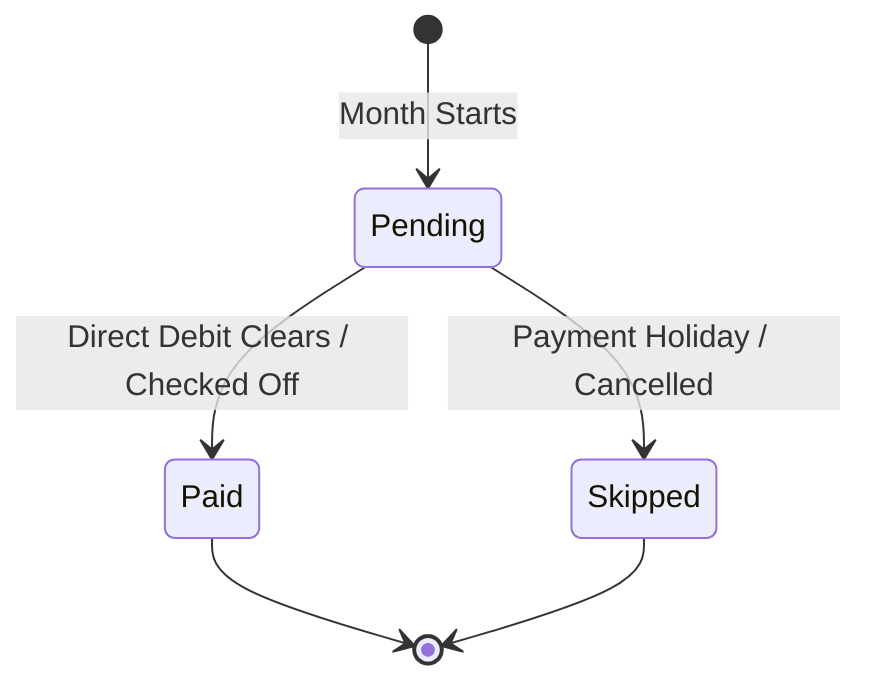

# Scheduled Bills & Direct Debits

The **Bills** tab in HABit serves as your master recurring expense engine. It tracks Direct Debits, Standing Orders, subscriptions, and annual expenses with calendar precision.

---

## 📋 Types of Scheduled Expenses

```
┌────────────────────────────────────────────────────────────────────────┐
│                        Scheduled Expense Types                         │
├───────────────────┬───────────────────┬────────────────────────────────┤
│ Fixed Bills       │ Variable Bills    │ Annual / Quarterly Items       │
│ (Mortgage, Rent,  │ (Electricity, Gas,│ (Car Insurance, TV License,    │
│  Council Tax)     │  Water Meter)     │  Annual Subscriptions)         │
└───────────────────┴───────────────────┴────────────────────────────────┘
```

### 1. Fixed Recurring Bills
- Consistent monthly expenses with unchanging amounts (e.g., Mortgage/Rent, Broadband, Phone Contract, Gym).
- Automatically mapped to the exact due day in every monthly cycle.

### 2. Variable Recurring Bills
- Monthly bills with fluctuating amounts (e.g., Winter vs. Summer energy bills, credit card statement balances).
- Set an estimated baseline that can be updated for specific months without breaking the annual template.

### 3. Multi-Month & Annual Recurring Bills
- Expenses occurring on non-monthly cadences:
  - **Yearly**: Car Insurance, Road Tax, Amazon Prime.
  - **Quarterly**: Water rates, quarterly subscriptions.
  - **4-Weekly**: Childcare or private school tuition.
- HABit automatically surfaces these expenses *only in the months they are due*, ensuring they appear in the correct weekly budget card.

---

## 🔄 Bill Status Lifecycle

Every scheduled bill progresses through clear lifecycle states:



1. **`Pending (Upcoming)`**: The bill is forecasted in the active week card. The amount is ringfenced so you know it cannot be spent.
2. **`Paid (Cleared)`**: The payment has cleared your bank account. Clicking the checkmark marks it paid, updating your running cash balance.
3. **`Skipped / Paused`**: If you have a payment holiday or one-off cancellation, skip the bill for that month without deleting the recurring master schedule.

---

## 📅 Working Day Shift for Direct Debits

Banks do not process Direct Debits on weekends or bank holidays. 
- If a bill has a due date of the **15th**, and the 15th falls on a **Sunday**, UK/US banks collect the funds on **Monday the 16th**.
- HABit's calendar engine automatically calculates the valid banking day and places the bill into the exact budget week when the cash will actually leave your account.

---

## 👥 Assigning Bills in Multi-User Households

In **Multi-User Household Mode**, every scheduled bill can be designated as:
- **`Joint`**: Shared household expenses (e.g. Rent/Mortgage, Utilities, Groceries) split across the household.
- **`Person 1`**: Private individual bills (e.g. Person 1's Personal Phone, Personal Loan).
- **`Person 2`**: Private individual bills (e.g. Person 2's Student Loan, Car Finance).

When filtering views in the top navigation bar, HABit dynamically displays only the bills relevant to the active household perspective!


---

## ⚡ Automated Bill Reconciliation via Open Banking & Statement Imports

HABit can automatically detect and clear your scheduled Direct Debits without any manual checking:
- **Date Matching Window (±4 Days)**: Accounts for bank holidays and weekend clearing delays.
- **`⚡ Auto-Cleared` Status Badge**: When a matching debit transaction is detected via Open Banking (Enable Banking, TrueLayer, GoCardless) or an uploaded statement (`.csv`/`.ofx`), HABit automatically marks the bill as **Paid**.
- For full setup details, read the [Open Banking & Bank Synchronization Guide](Open-Banking-and-Bank-Sync).
